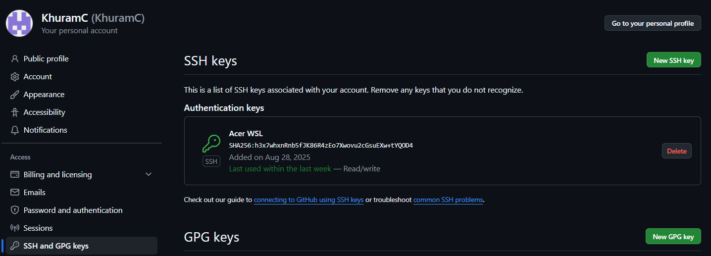

# EconomySim

## Steps to use Dev Containers

Dev Containers provide a common base to ensure that everything is the same between developers.
Although it does not need to be used, it is highly recommended, as issues could arise from not.

1.  Create a private/public key pair with `ssh-keygen`.

    1. If in Windows, create the key in WSL.

1.  Add the public key to your GitHub account in your settings.
    
1.  Clone the repo using ssh.

    1. If in Windows, clone the repo in WSL.

1.  Ensure that the ssh agent is running (so one can make commits in the dev container). You can insert the following into your `bashrc` or equivalent file so that it runs every time you open a new terminal:
    ```bash
    if [ -z "$SSH_AUTH_SOCK" ]; then
        RUNNING_AGENT="`ps -ax | grep 'ssh-agent -s' | grep -v grep | wc -l | tr -d '[:space:]'`"
        if [ "$RUNNING_AGENT" = "0" ]; then
            # Launch a new instance of the agent
            ssh-agent -s &> $HOME/.ssh/ssh-agent
        fi
        eval `cat $HOME/.ssh/ssh-agent` > /dev/null
        ssh-add $HOME/.ssh/id_ed25519 2> /dev/null
        # make sure to replace the ssh-key with the one you used for the GitHub
    fi
    ```
1.  Ensure the docker engine exists, like by installing [Docker Desktop](https://www.docker.com/products/docker-desktop/).
1.  Install the dev container extension in VSCode.
1.  Open the VSCode Command Pallete(Ctrl+Shift+P) to open the folder in the container.
    
1.  Ensure the folder being opened is the root of the repo(EconomySim), then press open.
    
1.  The container will take some time to build for the first time, but it should build just fine.
1.  Everything necessary should be already within the dev container to start developing either the frontend or backend.
