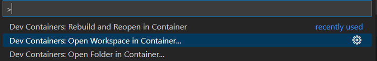

# EconomySim

## Steps to use DevContainers

1. If in Windows, use WSL for the repo, otherwise, just clone the repo.
1. Ensure the docker engine exists, like by installing Docker Desktop.
1. Install the devcontainer extension in VSCode
1. Open the backend folder in the container (if you are already in the folder, you can do open workspace probably)
   
1. Everything necessary should be already within the devcontainer to start developing either the frontend or backend.
