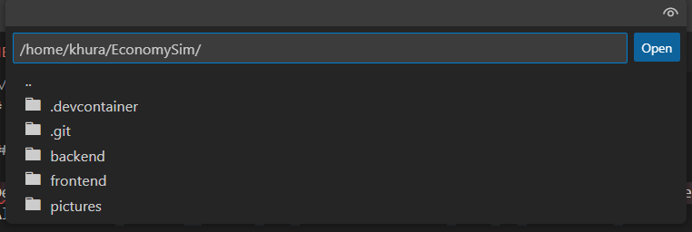

# EconomySim

## Steps to use DevContainers

Devcontainers provide a common base to ensure that everything is the same between developers.
Although it does not need to be used, it is highly recommended, as issues could arise from not.

1. If in Windows, use WSL for the repo, otherwise, just clone the repo.
1. Ensure the docker engine exists, like by installing Docker Desktop.
1. Install the devcontainer extension in VSCode.
1. Open the VSCode Command Pallete(Ctrl+Shift+P) to open the folder in the container.
   
1. Ensure the folder being opened is the root of the repo(EconomySim), then press open.
   
1. The container will take some time to build for the first time, but it should build just fine.
1. Everything necessary should be already within the devcontainer to start developing either the frontend or backend.

# A Simple Git Cheat Sheet for Our Project

The basic idea of Git is that you take "snapshots" of your work called **commits**. You do your work on a separate timeline called a **branch** to avoid messing up the main codebase. Then you share your commits by **pushing** your branch to a central online repository (like GitHub).

---

### ## 1. Starting Your Day & Getting the Latest Updates ☀️
This is the **first thing you should do every day** to make sure you have the most recent code from everyone else.

1.  **Switch to the main branch.**
    ```bash
    git switch main
    ```
2.  **Download and merge all changes from the remote repository.** This command fetches the updates and integrates them into your local copy.
    ```bash
    git pull
    ```

---

### ## 2. Saving and Sharing Your Work (The Core Loop) 💾
You've made some changes to the code and now you want to save them and share them with the team.

1.  **Check what you've changed.** This shows you a list of modified files.
    ```bash
    git status
    ```
2.  **Add all your changes to the "staging area."** This prepares them for being saved in a snapshot. The `.` means "all files in this folder."
    ```bash
    git add .
    ```
3.  **Create the snapshot (commit).** Save your staged changes with a clear, descriptive message about what you did.
    ```bash
    git commit -m "Describe your changes here, e.g., 'Added user login button'"
    ```
4.  **Upload (push) your saved commits to the remote repository.** This makes your work visible to everyone else.
    ```bash
    git push
    ```

---

### ## 3. Starting a New Feature or Task 🚀
Always create a new branch for each new task (e.g., building a new page, fixing a specific bug). This keeps your work isolated and safe from the main codebase.

1.  **First, make sure your `main` branch is up-to-date.** (See Scenario 1).
    ```bash
    git switch main
    git pull
    ```
2.  **Create a new branch and immediately switch to it.** Choose a descriptive name for your branch.
    ```bash
    git switch -c your-new-feature-name
    ```
    Now you can start coding! All your work will be saved on this new branch. When you're ready to save and share, just follow the steps in Scenario 2.

---

### ## 4. Combining Your Finished Feature into the Main Code ✅
Once your feature is complete and pushed, the best practice is to create a **Pull Request** (or Merge Request) on the project's GitHub/GitLab page. This lets the team review your code before it's officially merged into the `main` branch.

If you need to merge locally, follow these steps:

1.  **Switch to the main branch and make sure it's up-to-date.**
    ```bash
    git switch main
    git pull
    ```
2.  **Merge your feature branch into `main`.** This takes all the commits from your feature branch and applies them to the `main` branch.
    ```bash
    git merge your-new-feature-name
    ```
3.  **Push the updated `main` branch** to share the newly merged code.
    ```bash
    git push
    ```

---

### ## 5. "Oops!" - Undoing Mistakes 😬
Made a change you don't want? Here are some simple fixes.

* **To undo changes in a file that you have *not* committed yet:** This will revert the file to how it was at the last commit.
    ```bash
    git restore FileName.js
    ```
* **To throw away ALL uncommitted changes since your last save:** ⚠️ **Use with caution!** This action cannot be undone.
    ```bash
    git restore .
    ```

---

### ## 6. Getting the Project for the First Time (One-Time Setup) 💻
If you've never worked on the project before, you need to download it to your computer.

1.  **Clone (download) the repository.** You only ever need to do this once per project. Get the URL from the project's GitHub page.
    ```bash
    git clone <paste_the_repository_url_here>
    ```
2.  **Tell Git who you are.** This is important so your commits are attributed to you. You only need to do this once per computer.
    ```bash
    git config --global user.name "Your Name"
    git config --global user.email "your.email@example.com"
    ```

### ## Golden Rule ✨
**Commit often** with clear messages. Before you `push`, always `pull` to get the latest changes and avoid conflicts.