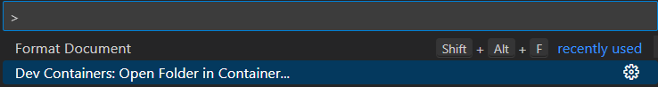

# EconomySim

## Steps to use DevContainers

Devcontainers provide a common base to ensure that everything is the same between developers.
Although it does not need to be used, it is highly recommended, as issues could arise from not.

1. If in Windows, use WSL for the repo, otherwise, just clone the repo.
1. Ensure the docker engine exists, like by installing Docker Desktop.
1. Install the devcontainer extension in VSCode.
1. Open the VSCode Command Pallete to open the folder in the container.
   
1. Ensure the folder being opened is the root of the repo(EconomySim), then press open.
   
1. The container will take some time to build for the first time, but it should build just fine.
1. Everything necessary should be already within the devcontainer to start developing either the frontend or backend.
