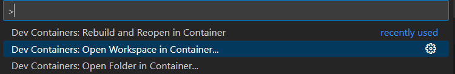

# Backend

## Steps to use DevContainers

1. Ensure the docker engine exists, preferably by installing Docker Desktop.
1. Install the devcontainer extension in VSCode
1. Open the workspace in the container

1. Everything necessary should be already within the devcontainer to start developing.
